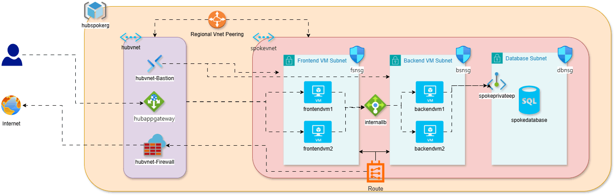
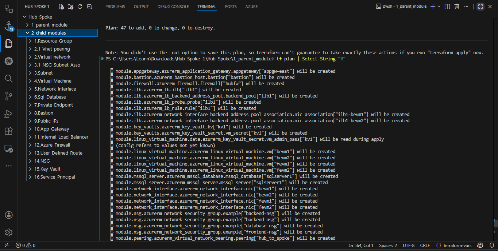

# 🌐 Azure Hub and Spoke Architecture using Terraform

This project demonstrates the implementation of a **Hub and Spoke network topology in Microsoft Azure** using **Terraform (Infrastructure as Code)**.

The architecture provides **centralized security, scalable networking, and workload isolation** following Azure best practices.

---

## 📌 Overview

The **Hub-Spoke model** is a widely adopted Azure networking pattern where:

- The **Hub VNet** handles shared services (Firewall, Bastion, Gateway)
- The **Spoke VNets** host application workloads
- Traffic is routed through the hub for centralized control and security

---

## 🏗️ Architecture Diagram

<p align="center">
  
</p>

<p align="center">
  <em>Azure Hub & Spoke Architecture</em>
</p>

---

## ⚙️ Technologies Used

- Microsoft Azure  
- Terraform (IaC)  
- Azure Virtual Network (VNet)  
- Azure Firewall  
- Azure Bastion  
- Application Gateway  
- VNet Peering  
- User Defined Routes (UDR)  
- Network Security Groups (NSG)  

---

## 📂 Project Structure

<details>
<summary>Click to expand</summary>

```

.
├── modules/
│   ├── network/
│   │   ├── vnet/
│   │   ├── subnet/
│   │   ├── nsg/
│   │   ├── route_table/
│   │   └── vnet_peering/
│   │
│   ├── compute/
│   │   ├── virtual_machine/
│   │   ├── network_interface/
│   │   └── bastion/
│   │
│   ├── security/
│   │   ├── azure_firewall/
│   │   ├── key_vault/
│   │   └── private_endpoint/
│   │
│   ├── load_balancing/
│   │   ├── application_gateway/
│   │   └── internal_load_balancer/
│   │
│   └── database/
│       └── sql_database/
│
├── environments/
│   └── dev/
│       ├── main.tf
│       ├── variables.tf
│       ├── terraform.tfvars
│       └── backend.tf
│
├── global/
│   ├── provider.tf
│   ├── variables.tf
│   └── outputs.tf
│
├── .gitignore
└── README.md

````

</details>

---

## 🧠 Key Features

- Centralized Hub Network  
- Secure VNet Peering  
- Controlled Traffic via Firewall & UDR  
- Modular Terraform Code  
- Scalable Architecture  

---

## 🚀 Deployment Steps

```bash
git clone https://github.com/ShivShrivastava/Project_-Hub-and-Spoke-Architecture_-Azure_-Terraform.git
cd Project_-Hub-and-Spoke-Architecture_-Azure_-Terraform

terraform init
terraform validate
terraform plan
terraform apply -auto-approve
````

---

## 📊 Terraform Plan Output

<p align="center">
  
</p>

<p align="center">
  <em>Terraform execution plan</em>
</p>

---

## 👨‍💻 Author

Shiv Shrivastava
DevOps Engineer | Azure | Terraform | Kubernetes
